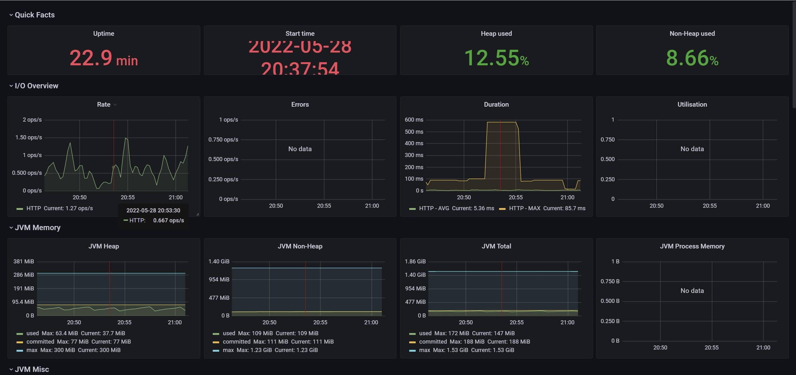
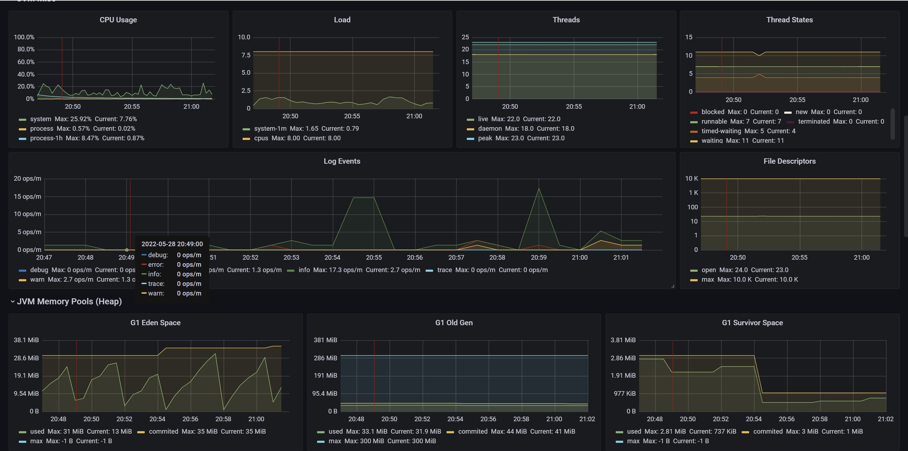
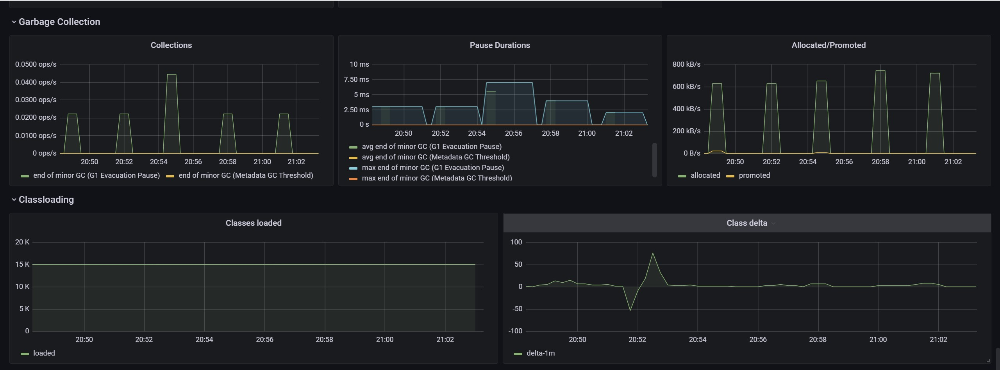

# Advanced Programming Group Project: GASKEUN

## Group Members:
  - Alexander Caesario Bangun
  - Rashad Aziz (2006519984)
  - Arya Fakhruddin Chandra
  - Anne Yuliana
  - Johanes Christian Lewi Putrael Tarigan

# Application Monitoring
To analyze our application, we simulate traffic by creating and updating the entities in the database. We simulate the creation request by repeatedly submitting invalid form data before submitting valid data. The monitoring result is shown in the collection of screenshots below.

As shown in the Rate panel, the application overall throughput when the user submits an invalid data is around 0.75 ops/sec. This implies that the application does not perform a lot of computation in handling such cases. This is perhaps due to the fact that the application only perform simple boolean expression evaluation without interacting with the repository. On the other hand, the 2 valid request (provider registration and order creation) resulted to an overall throughput of around 1.5 ops/sec. However, the peak of the order creation appears to be higher than the provider registration.
Regarding the response latency for all 'testing' relating to the order creation, it can be seen that it requires 600ms for the application to complete the request. This response time is considerably high and is noticeable from the user's point of view. This is perhaps caused by multiple interactions with the repository, including searching for the entity in the database before saving and redirecting the user to a new page.
The gradual spikes in the JVM heap are due to the creation of DTOs in each entity creation request. While accessing the page, we instantiate a DTO to be passed to the thyme leaf HTML. Due to the repeated request to access the page, multiple DTOs are created, reflecting the repeated increase in the JVM Heap Memory.

From the screenshot above, we can also see that there are info and error log events around the order creation. The error log is due to the user's invalid request submitted to the server. On the other hand, there is much info-log during 20.54-20.55, which is associated with the updates of application state in processing and saving the order entity. On the other hand, we did not observe any significant increase in CPU usage over the observed time. Here, the application uses at most 20% of the CPU resource.

As can be seen, there is a lot of garbage collection during the observed time. Again, this is associated with creating DTOs and entities in the users and provider registration. For example, suppose a submitted form is valid, after saving the entity in the repository, the function returns the saved object which is not assigned to any variable and thus is marked for removal. Similarly, the DTOs of those valid requests will also be dropped when the page redirects. Consequently, the amount of garbage collected is noticeable.

